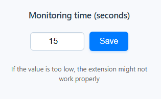

# YouTube Popup Remover Extension

A lightweight web extension that automatically detects and bypasses YouTube's adblock detection modals, resumes video playback if paused, and intelligently handles live streams and video playback events.

## 📦 Features

- Detects and dismisses YouTube’s adblock modals.
- Automatically resumes video playback if paused by modal.
- Observes URL changes and reloads the observer accordingly.
- Customizable observer timeout via extension popup.
- Smart handling for live streams and videos already in progress.

## 📸 Screenshots

## 🛠️ Installation

1. Clone the repository.
2. Go to `chrome://extensions/` in your browser.
3. Enable **Developer Mode**.
4. Click **Load unpacked** and select the extension folder.

## 📃 License

This project is licensed under the [Apache License 2.0](LICENSE).

### 📌 License Scope Notice

As of **May 29, 2025**, this project is licensed under the Apache License 2.0.  
All previous commits and code history are retroactively covered by this license unless explicitly stated otherwise.

---

## 📬 Contact

For issues, feature requests, or contributions, please open an issue or submit a pull request.

**Repository:** [YouTube Popup Remover](https://github.com/htmyname/youtube-popup-remover)
